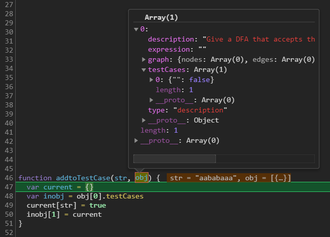
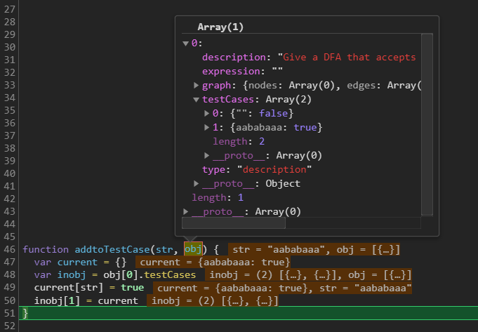

#### My question
I want to add a property { "aabb" : true }to an object. 

```javascript 
var str = "aabb"
function test(){
  var obj = {
    str : true
  }
}
test()
console.log(obj.str) // true 
```
This means obj has {str:true} rather than {"aabb":true}.

All properties between "{ }" will be what they are. So ***variable name***  "str" will be add to obj, rather than ***variable itself***


#### Simple solution (Trade off)
```javascript 
var str = "aabb"
function test(){
  var obj = {};
  obj[str] = true;
}
test()
```
create a variable ***var obj = {};*** with "{ }", and then add correct str to the obj by using ***"[ ]"***. In javascript, all variables betweem [] will be replace by it's value, so it works. 


#### Add a property to a existing property (Complex situation)



This is the real problem I am running into. My goal is adding a test cast to ***obj[0].testCases***

My solution is create a ***"var current = {}"*** first (Reason: see Simple solution above). Then go inside the object and resign the value.
```javascript
function addtoTestCase(str, obj) {
  var current = {}
  var inobj = obj[0].testCases
  current[str] = true
  inobj[1] = current
}
```

